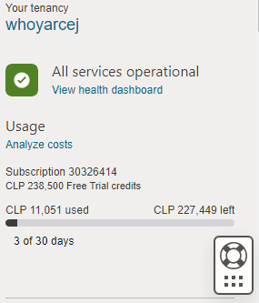
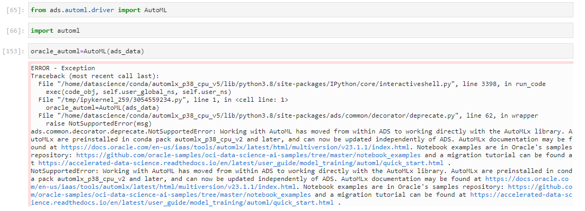
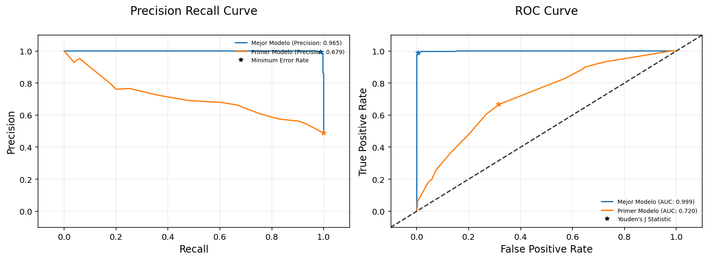
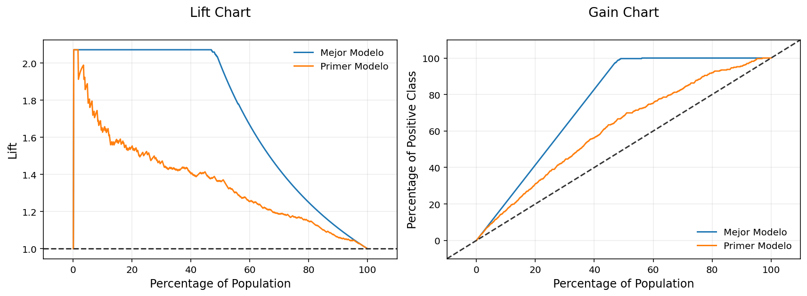
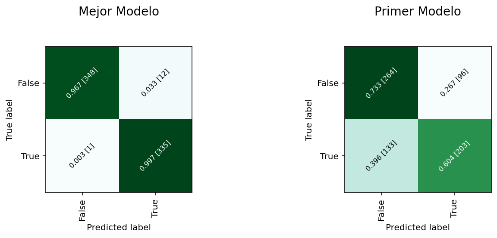
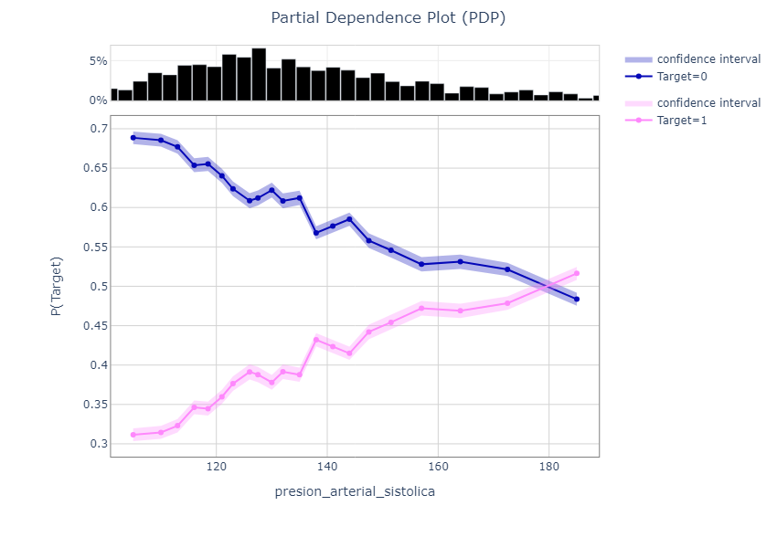
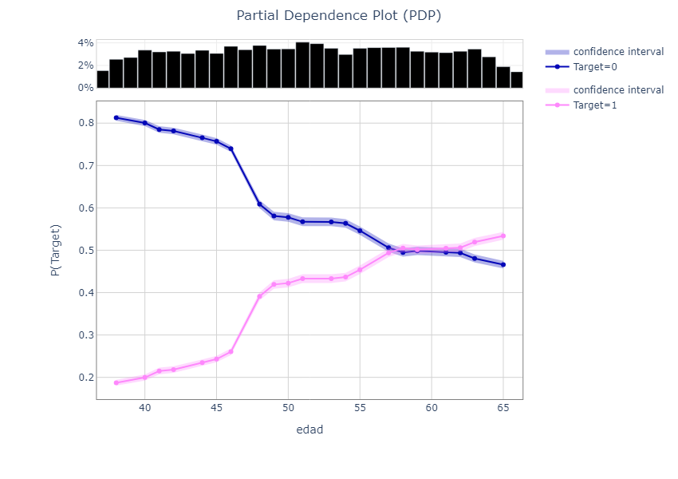
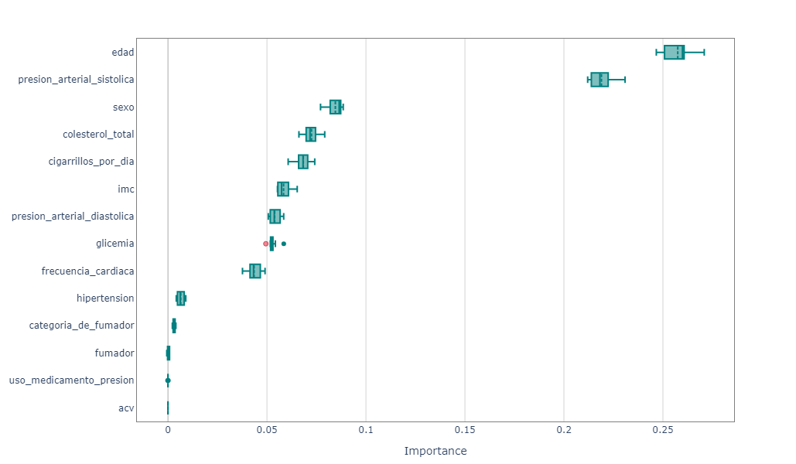
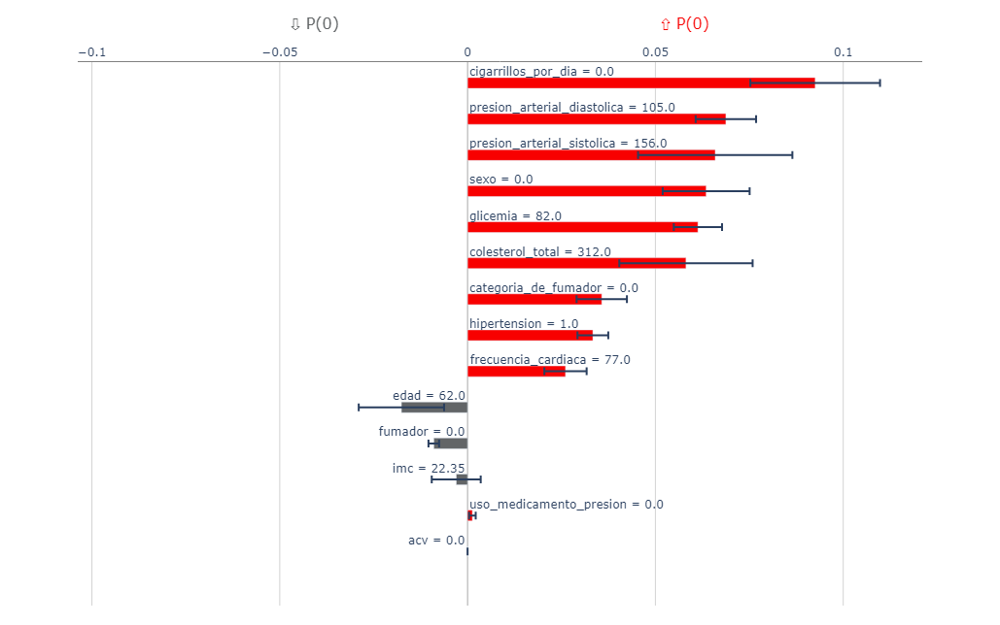

En el curso octavo llamado **Machine Learning con Oracle ADS: productividad en la creación de modelos** de la formación Python, Data Science en OCI y Oracle Analytics la cual pertenece a los cursos de Alumni ONE existen dos problemas importantes:

1.-Este curso pertenece a los últimos 3 cursos de la formación de Data Science los cuales requieren el uso de recursos **PAGADOS** Oracle Cloud Infrastructure. Si se crea una cuenta free tier, esta cuenta otorga un crédito de 300 USD por 30 días. En base a la planificación de Oracle Next Education, la formación de Data Science debiera realizarse en Enero de 2024, fecha en la cual ya NO existirá el crédito de 30 días si la cuenta se creo en Noviembre de 2023, fecha en la cual se debería haber realizado la formación OCI del programa ONE.

2.- En el curso se hace uso de la librería automl la cual ya no existe en el kernel utilizando en el curso el cual se llama General Machine Learning for CPUs on Python 3.8. El problema NO se soluciona instalando la librería ya que al querer hacerlo el notebook queda congelado.

Mis soluciones para ambos problemas son las siguientes:

1.- Creación de una NUEVA cuenta Oracle Cloud Infrastructure, es decir, ahora poseo dos cuentas en OCI. La primera cuenta es la que utilicé para realizar la formación OCI y en la cual el crédito de 30 días ha vencido. La segunda cuenta con la cual estoy realizando la formación de DataScience, posee habilitado el crédito de 30 días. A la fecha llevo consumido el siguiente monto:



2.-Examinando la documentación observo que la librería automl ya no esta incluida en ads sino en otro kernel llamado **Oracle AutoML and Model Explanation for Python 3.8**. Cambiando de kernel al anterior y ejecutando el código del curso observo que el método utilizado NO existe mostrándose la siguiente excepción:



La excepción señala que la librería automl se ha movido a una nueva librería llamada **AutoMLx** y al observar la documentación constato que las clases han cambiado y el nombre de métodos también lo ha hecho. Por tanto, la mayoría de métodos utilizados en el curso **NO** funcionarán ya que no existen en las nuevas clases. La solución a este problema es leer la documentación y guiarse por ella. En este repositorio comparto el notebook con el código que he utilizado para replicar lo realizado por el instructor pero ahora utilizando AutoMLx.

A continuación muestro los gráficos más relevantes del curso:

### 1. Precision Recall Curve y ROC Curve para la comparación entre modelo generado por AutoMLx optimizado y modelo DecisionTreeClassifier con un max_depth=100



### 2. Lift Chart and Gain Chart para la comparación entre modelo generado por AutoMLx optimizado y modelo DecisionTreeClassifier con un max_depth=100



### 3. Matriz de confusión para la comparación entre modelo generado por AutoMLx optimizado y modelo DecisionTreeClassifier con un max_depth=100



### 4. Partial dependence plots (PDP) para la feature presion_arterial_sistolica



### 5. Partial dependence plots (PDP) para la feature edad



### 6. Explicación global de clasificación



### 7. Explicación individual de feature en la clasificación

El registro de data individual esta dado por el siguiente dataframe para la variable X y la siguiente Series para la variable y:

```
X=test.X.iloc[[13]]    # Dataframe

y=test.y.iloc[[13]]    # Series
```


